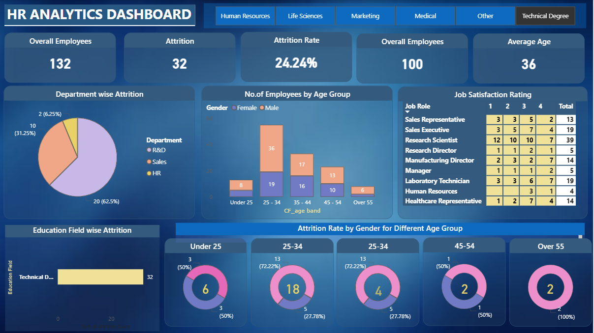

# 📊 HR Analytics Dashboard

## 📌 Project Overview

This project presents an interactive HR Analytics Dashboard developed using Power BI to analyze employee attrition, workforce demographics, and job satisfaction. The dashboard helps identify workforce trends and supports data-driven human resource decisions.

## ❗ Problem Statement

Organizations often struggle to monitor employee turnover and workforce patterns without proper data visualization. This project addresses the problem by providing a dashboard to analyze attrition and employee characteristics.

## 🎯 Objectives

* Monitor employee attrition rate
* Identify departments with high turnover
* Analyze workforce demographics
* Support HR decision-making

## 🗂️ Dataset

The dataset contains employee information such as age, department, job role, education field, and attrition status.

## 🛠️ Tools and Technologies

* Power BI
* Microsoft Excel
* Data Visualization

## 📈 Key Visualizations

* KPI Cards (Total Employees, Attrition Rate, Average Age)
* Department-wise Attrition Chart
* Age Group Distribution Chart
* Job Satisfaction by Job Role
* Education Field Attrition Chart

## 🖼️ Dashboard Screenshots

## 🔍 Key Findings

* Attrition rate is approximately 24%
* Highest attrition occurs in the R&D department
* Most employees belong to the 25–34 age group

## ✅ Conclusion

The dashboard provides insights into employee attrition patterns and supports workforce planning and decision-making.

## 🚀 Future Enhancements

* Add predictive analytics for attrition
* Integrate real-time data
* Expand dashboard visualizations

## 👤 Author

Hiba Fathima Y
